# Cybersecurity & Infrastructure Homelab

## Architektura środowiska

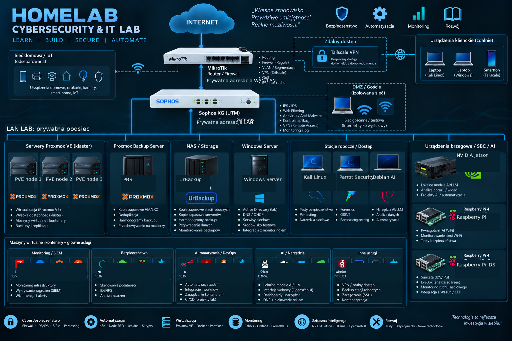

> Diagram przedstawia zanonimizowany widok mojego środowiska laboratoryjnego. Adresacja IP, hostnames i dane umożliwiające identyfikację infrastruktury zostały usunięte.

Autorskie środowisko laboratoryjne do praktycznej administracji systemami, wirtualizacji, monitoringu, backupu, automatyzacji i bezpieczeństwa.

> Repozytorium opisuje architekturę i zakres projektu. Celowo nie zawiera sekretów, danych uwierzytelniających ani informacji umożliwiających zdalny dostęp do infrastruktury.

## Cele projektu
- administracja Linux i Windows,
- utrzymanie środowiska wirtualizacyjnego,
- monitoring hostów i usług,
- analiza logów i zdarzeń bezpieczeństwa,
- IDS i skanowanie podatności,
- backup i scenariusze odtwarzania,
- automatyzacja powtarzalnych zadań,
- testowanie lokalnych modeli AI wspierających diagnostykę.

## Architektura logiczna

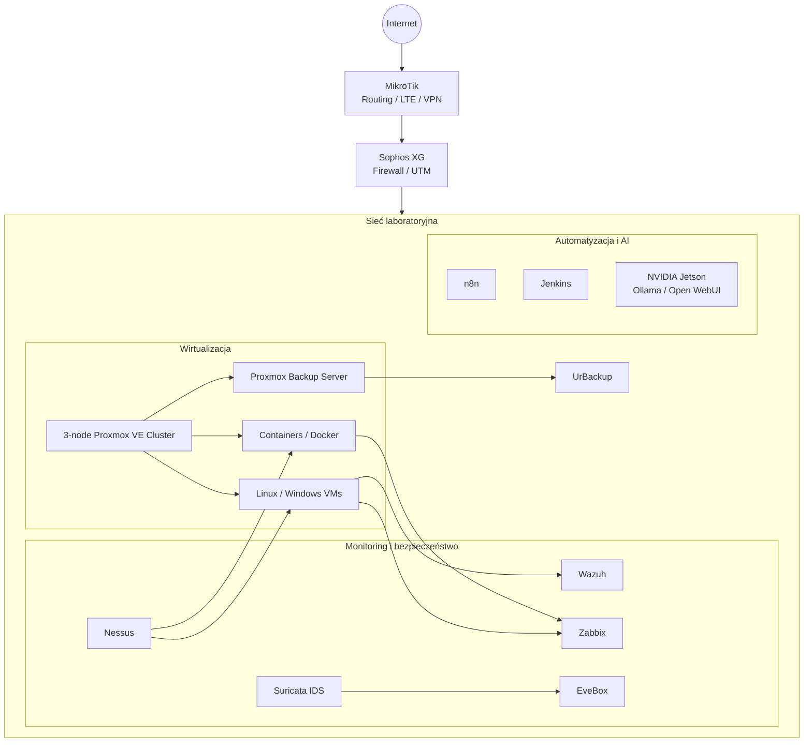

## Wirtualizacja
- 3-węzłowy klaster **Proxmox VE**,
- maszyny wirtualne Linux i Windows,
- kontenery i usługi Docker,
- testowanie aktualizacji i zależności między usługami.

## Monitoring — Zabbix
- dostępność hostów,
- stan usług,
- wykorzystanie zasobów,
- podstawowe parametry urządzeń sieciowych.

## SIEM — Wazuh
- centralizacja logów,
- praca z agentami,
- analiza alertów,
- obserwacja zdarzeń bezpieczeństwa na hostach.

## IDS — Suricata + EveBox
- sensor IDS w środowisku laboratoryjnym,
- analiza zdarzeń sieciowych,
- przegląd i korelacja alertów.

## Vulnerability Management — Nessus
- skanowanie infrastruktury laboratoryjnej,
- analiza wyników,
- planowanie aktualizacji i korekt konfiguracji.

## Backup i odtwarzanie
- **Proxmox Backup Server** — backup środowiska Proxmox,
- **UrBackup** — kopie systemów i danych,
- testy scenariuszy awarii i przywracania.

## Sieć i dostęp
- MikroTik,
- Sophos XG,
- LAN/WAN,
- VPN / Tailscale.

## Automatyzacja
- Bash,
- PowerShell,
- Jenkins,
- n8n,
- Git.

## Lokalne AI
Na platformie **NVIDIA Jetson** testuję Ollama, Open WebUI i lokalne modele LLM do wspomagania diagnostyki i analizy informacji technicznych.

## Przykładowy proces diagnostyczny
1. Weryfikacja dostępności hosta i usługi.
2. Sprawdzenie stanu systemu i procesów.
3. Analiza danych z Zabbix.
4. Sprawdzenie logów w Wazuh.
5. Weryfikacja zdarzeń Suricata/EveBox.
6. Analiza wyników Nessus, jeśli problem może mieć związek z podatnością lub konfiguracją.
7. Weryfikacja backupu przed zmianami o podwyższonym ryzyku.
8. Wdrożenie poprawki i ponowny test.

## Case Studies

### Zabbix unavailable after system restart

Praktyczny przykład diagnostyki awarii, w której frontend monitoringu przestał być dostępny po restarcie serwera. Analiza wykazała problem z konfiguracją adresacji sieciowej, a nie z samym Zabbixem.

Opis obejmuje:

- analizę objawów,
- diagnostykę warstwy sieciowej,
- wykorzystanie niezależnego dostępu przez Tailscale,
- identyfikację przyczyny,
- weryfikację usług po naprawie,
- działania zapobiegawcze.

➡️ [Czytaj case study](docs/case-studies/zabbix-network-recovery.md)

---

### n8n / PostgreSQL recovery after PBS restore

Case study opisujący sytuację, w której poprawnie wykonany restore z Proxmox Backup Server odtworzył ten sam wadliwy stan aplikacji.

Opis obejmuje:

- rozdzielenie problemu infrastruktury od stanu aplikacji,
- diagnostykę PostgreSQL i n8n,
- zachowanie persistent data,
- odbudowę warstwy Docker / Compose,
- niezależną weryfikację bazy i GUI,
- analizę zewnętrznych zależności workflow,
- wnioski dotyczące jakości restore pointów.

➡️ [Czytaj case study](docs/case-studies/n8n-postgresql-pbs-recovery.md)

---

## Zasady bezpieczeństwa repozytorium
Nie publikuję haseł, tokenów, kluczy API, prywatnych kluczy SSH, publicznych adresów administracyjnych, danych klientów ani kompletnych backupów urządzeń.

## Środowisko w praktyce

Poniższe zrzuty przedstawiają działające elementy mojego środowiska laboratoryjnego. Dane infrastruktury zostały zanonimizowane przed publikacją.

### Proxmox VE

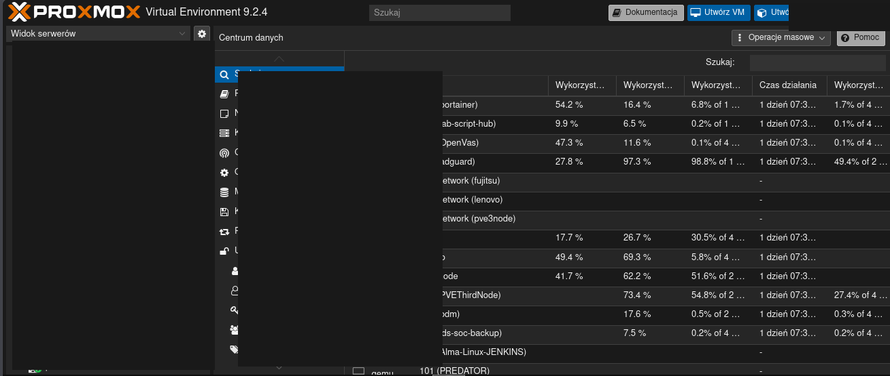

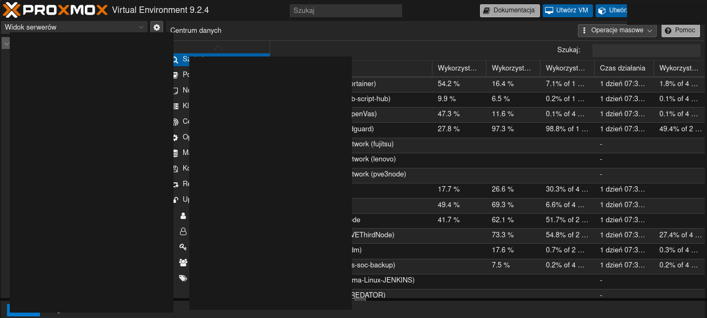

### Suricata / EveBox

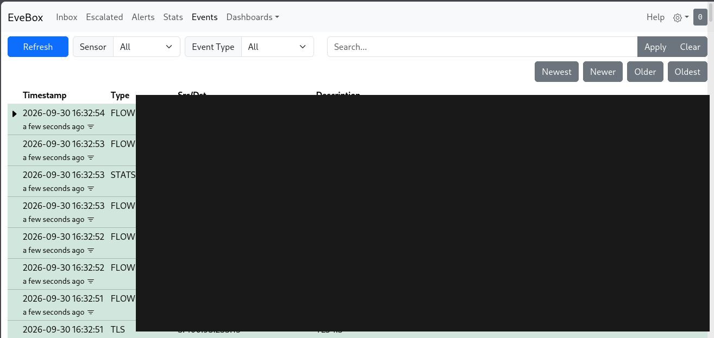

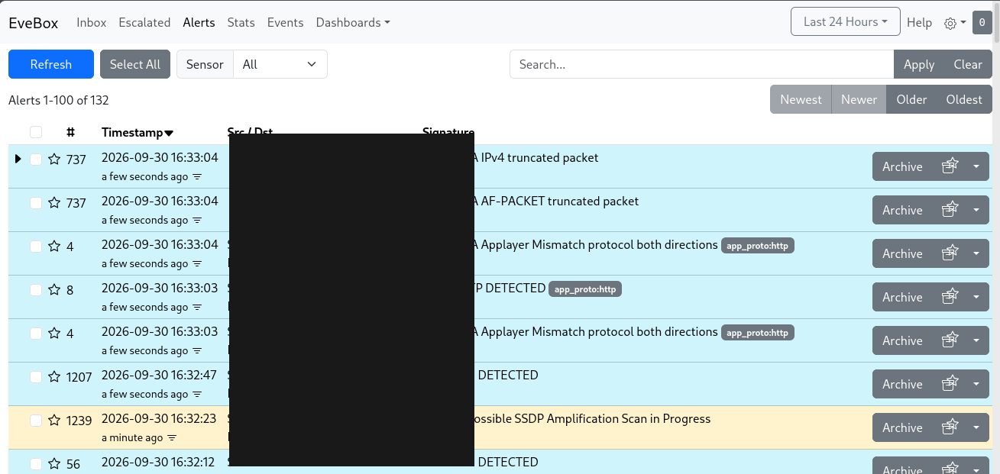

### Zabbix

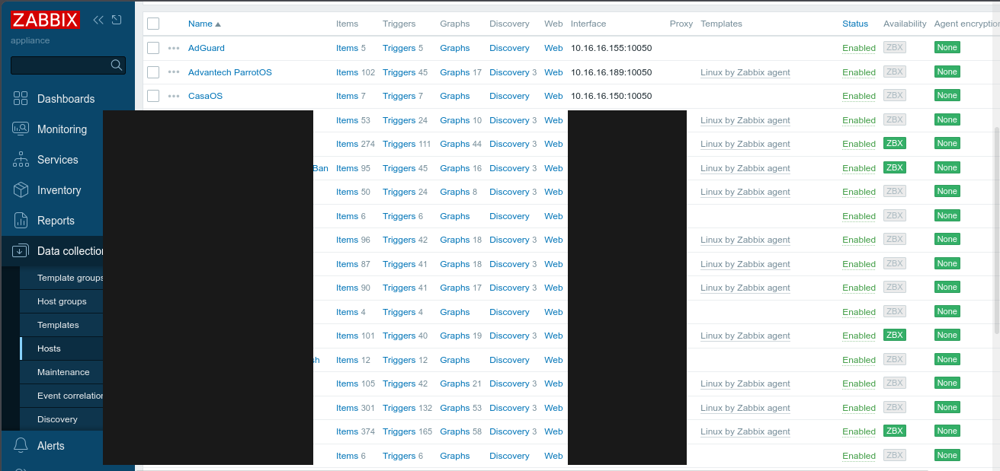

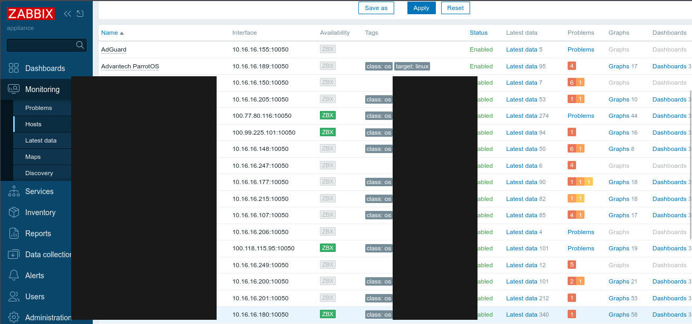

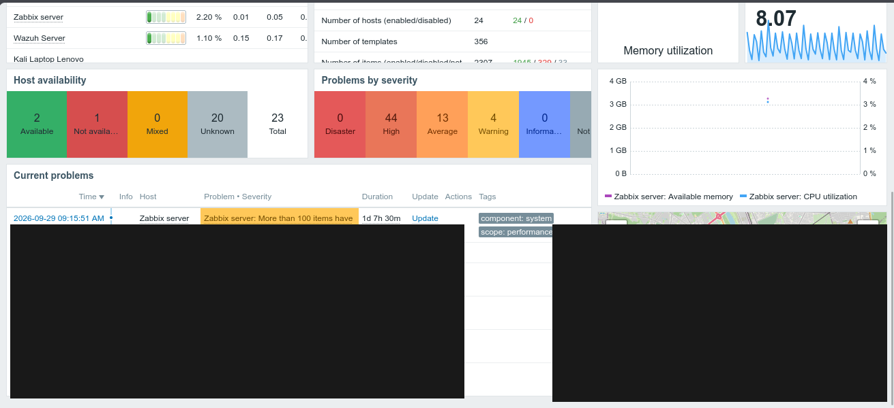

### Wazuh

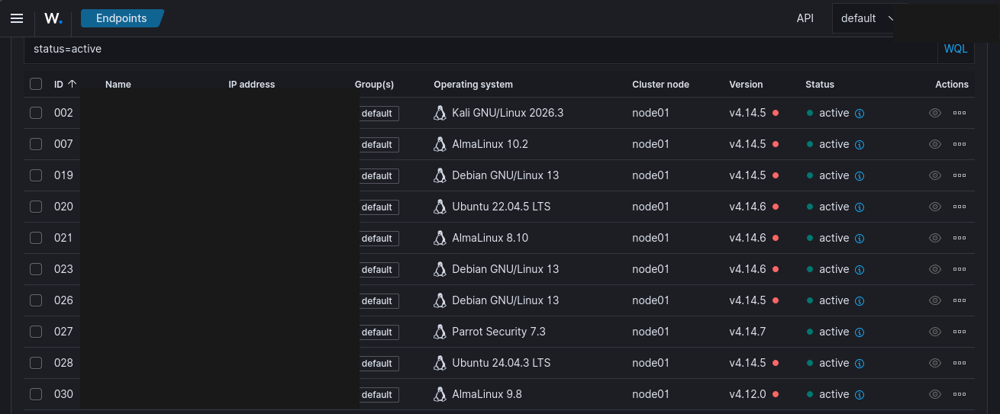

### LAB Dashboard

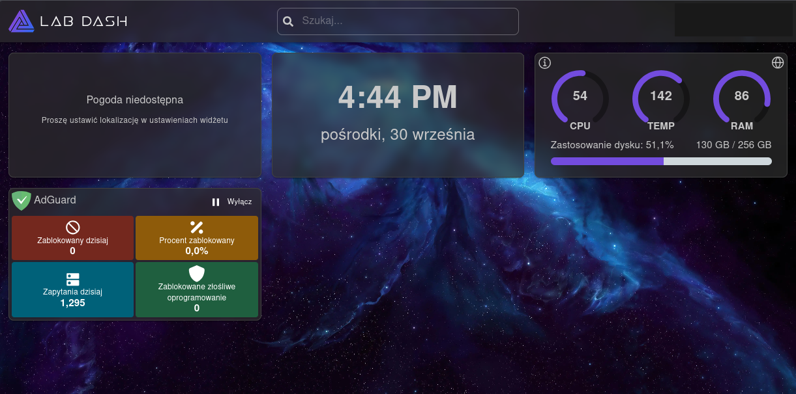

### n8n

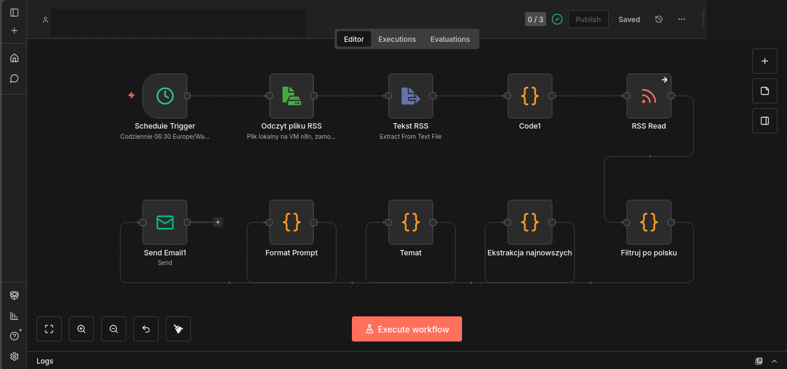
